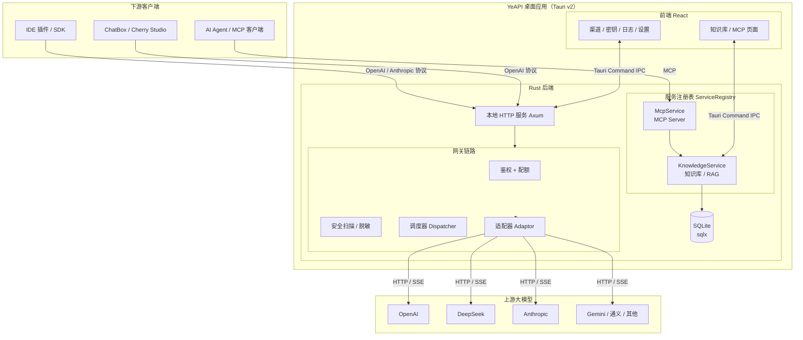

# YeAPI

> 本地 LLM API 网关 + 知识库 —— 一个跑在桌面上的「大模型中台」，把多家大模型渠道收拢成**一个统一的本地 API 入口**，并内置**安全审计、请求调度、本地 RAG 知识库**与 **MCP Server**。

YeAPI 是一个基于 [Tauri v2](https://tauri.app) 的桌面应用：前端用 React 管理配置，后端用 Rust 在本地拉起一个 HTTP 服务（默认 `127.0.0.1:8777`）。你在界面里配好渠道与密钥后，任何兼容 OpenAI / Anthropic 协议的客户端把 `base_url` 指向它，即可统一调度你所有的大模型账号；上传的文档会被自动解析、向量化并构建索引，通过 MCP 协议供任意 AI Agent 检索与问答。

---

## 下载安装

各平台安装包（macOS / Windows / Linux）请到 [Releases 最新版](https://github.com/yewick/API_GateWay/releases/latest) 下载。

[](https://github.com/yewick/API_GateWay/releases/latest)

### macOS 首次打开提示

macOS 包为默认 ad-hoc 签名（未做 Apple 公证），从浏览器下载后会被系统打上隔离标记，首次打开可能提示「已损坏，无法打开」或「无法验证开发者」。这是 Gatekeeper 的正常拦截，按以下任一方式绕过即可：

- **命令行（推荐）**：先把 `YeAPI.app` 拖入「应用程序」文件夹，再执行
  ```bash
  xattr -dr com.apple.quarantine "/Applications/YeAPI.app"
  ```
  若仍不行，改用 `xattr -c "/Applications/YeAPI.app"` 清除全部扩展属性。
- **右键打开**：在「访达」中右键点击 `YeAPI.app` →「打开」，在弹出的对话框再点一次「打开」。
- **系统设置**：前往「系统设置 → 隐私与安全性」，在底部找到「仍要打开」。

> 若要彻底消除该提示，需使用 Apple Developer ID 证书签名并做公证，目前暂未配置。

---

## 功能特性

### 网关核心

- **多渠道聚合**：OpenAI / DeepSeek / Anthropic Claude / Google Gemini / 通义千问 / 智谱 GLM / Moonshot Kimi / 豆包 / Ollama / 自定义（OpenAI 兼容），统一适配、统一入口。
- **多协议对外**：同时提供 OpenAI Chat Completions、OpenAI Responses、Anthropic Messages 三套协议，客户端无需改代码即可接入。
- **智能调度**：按「优先级 + 组内权重」构建故障转移队列，主渠道失败自动降级到下一个，直到成功或耗尽；支持重试。
- **密钥管理**：面向下游签发 API Key，支持配额（token 上限）、过期时间、允许模型 / 渠道白名单。
- **模型映射**：把对外暴露的模型名翻译成上游真实模型名（如 `gpt-4o → gpt-4o-2024-11-20`）。
- **流式透传**：SSE 字节级透传，旁路解析 token 用量，不影响转发。

### 安全审计引擎

- **双向扫描**：请求 / 响应两侧扫描，检测凭证泄露、Unicode 隐写、工具 / 网络风险。
- **四级动作**：审计、告警、脱敏、阻断（命中高危可返回 `451`）。
- **数据脱敏**：转发前自动打码疑似密钥（`sk-…`、`AKIA…`、GitHub Token 等）。
- **规则体系**：内置规则可单独启停 / 调级；自定义规则支持正则 / 关键词 + 黑白名单豁免。

### 本地知识库（RAG）

- **多格式解析**：PDF（三后端：纯 Rust `unpdf` / PyMuPDF / MinerU 云解析）、DOCX、XLSX、CSV、PPTX、HTML、TXT、Markdown，以及 30+ 种代码文件（tree-sitter 提取符号）。
- **智能分块**：通用文本按行、Markdown 按标题（携带祖先标题上下文）、代码按**函数 / 类符号边界**。
- **向量化与索引**：复用网关渠道调用 Embeddings API，构建轻量级单层 **HNSW** 索引，支持增量更新与持久化。
- **三种检索模式**：`hybrid`（向量 + 关键词混合加权，默认 0.7 / 0.3）、`vector`（纯语义）、`keyword`（FTS5 关键词，中文走 CJK bigram 分词）。
- **RAG 问答**：检索 → 上下文装配（三级降级适配上下文窗口）→ LLM 生成 → 来源引用，支持多轮对话历史。
- **来源导入**：支持导入 Git 仓库 / 网页 URL / 本地目录。

### MCP Server

- **标准 MCP 协议**：实现 Model Context Protocol，支持 Streamable HTTP（`/mcp`）与 SSE（`/mcp/sse`）两种传输。
- **13 个知识库工具**：检索、RAG 问答、知识库 CRUD、文档上传 / 删除 / 列表、索引构建、来源导入等，任意 AI Agent（Claude Desktop、Cursor 等）开箱即用。

### 观测与桌面

- **仪表盘 / 用量 / 日志**：请求量、token 用量、活跃渠道、平均延迟、按日统计、多协议分布；每条请求全量留痕（命中渠道、耗时、风险等级、安全发现、上游真实模型）。
- **系统托盘**：最小化 / 关闭到托盘、开机自启、多主题（深色 / 浅色 / 墨纸 / 跟随系统）、自动更新。
- **跨平台**：macOS（Apple Silicon + Intel）/ Windows / Linux，GitHub Actions 打 tag 自动发版。

---

## 架构

### 总览



### 一次请求的流转

```
客户端请求
   │
   ▼
鉴权（Bearer / x-api-key）── 校验密钥、过期时间、配额预检
   │
   ▼
安全扫描（请求侧）── 风险分级 → 阻断(451) / 脱敏 / 放行
   │
   ▼
调度器 Dispatcher ── 过滤启用且支持该模型的渠道，按优先级 + 权重排序
   │
   ▼
适配器 Adaptor ── 策略模式统一各家协议差异 → 上游转发（非流式 / SSE 透传）
   │
   ▼
响应侧安全扫描（可选）── 合并发现、升级风险等级
   │
   ▼
写日志 + 扣减配额 ── 记录命中渠道、token 用量、耗时、风险摘要
```

### 分层说明

| 层           | 职责                   | 关键模块                                                                                    |
| ------------ | ---------------------- | ------------------------------------------------------------------------------------------- |
| **前端**     | 配置管理、可视化       | React 19 · TS · Vite 7 · Tailwind 4 · Zustand · TanStack Query                              |
| **命令层**   | 前端 ↔ Rust IPC        | `src-tauri/src/commands/*`（渠道 / 密钥 / 日志 / 知识库 / MCP …）                           |
| **网关核心** | 鉴权、安全、调度、转发 | `server/`（Axum 路由 + 处理器）、`core/`（`dispatcher` + `proxy`）、`adaptor/`、`security/` |
| **协议层**   | 多协议互转             | `protocol/`（OpenAI ↔ Anthropic ↔ Responses）                                               |
| **服务层**   | 插件式子服务           | `services/knowledge`（解析 / 分块 / 向量 / HNSW / RAG）、`services/mcp`（JSON-RPC / SSE）   |
| **存储层**   | 数据持久化             | `db/`（SQLite + `migrations/`）                                                             |

## 技术栈

| 层             | 技术                                                                                            |
| -------------- | ----------------------------------------------------------------------------------------------- |
| 桌面框架       | Tauri v2（Rust + WebView）                                                                      |
| 前端           | React 19 · TypeScript · Vite 7 · Tailwind CSS 4 · Zustand · TanStack Query · react-router-dom 7 |
| 本地 HTTP 服务 | Axum 0.8 · tokio · tower-http（CORS）                                                           |
| 上游请求       | reqwest（流式 SSE）                                                                             |
| 数据存储       | SQLite（sqlx） · tauri-plugin-store（配置）                                                     |
| 文档解析       | unpdf / calamine / zip / roxmltree / html2text · tree-sitter（代码符号） · MinerU（云）         |
| 向量索引       | 自研轻量 HNSW（bincode 持久化）                                                                 |
| 桌面插件       | store / sql / autostart / dialog / notification / clipboard / opener / shell / updater          |

---

## 快速开始

### 环境要求

- **Node.js** ≥ 20.19（Vite 7 要求），推荐 22+
- **Rust** stable（Tauri v2 要求）
- **平台依赖**（仅 Linux 需要）：`libwebkit2gtk-4.1-dev`、`libayatana-appindicator3-dev`、`libssl-dev`、`libsqlite3-dev` 等（CI 已配好）

### 安装依赖

```bash
npm install
```

### 开发调试

```bash
npm run tauri dev
```

前端 Vite 跑在 `http://localhost:1420`，Rust 后端随窗口启动，本地 HTTP 服务默认监听 `127.0.0.1:8777`。

### 构建打包

```bash
npm run tauri build
```

产物在 `src-tauri/target/release/bundle/`（`.app` / `.dmg` / `.msi` / `.exe` / `.deb` 等）。

---

## 使用指南

### 1. 添加渠道

进入「渠道」页，点「新增渠道」：

- **类型**：选择厂商（OpenAI、DeepSeek、Claude、Gemini、通义千问……或「自定义」填 OpenAI 兼容地址）。
- **Base URL** 与 **API Key**：填入上游账号信息。
- **模型**：该渠道支持的模型列表；留空表示支持所有模型。
- **优先级 / 权重**：优先级高的渠道先被尝试；同优先级内按权重随机分配流量。
- **模型映射**：可选，把对外暴露的模型名映射到上游真实模型名。

保存后可点「测试」验证连通性。

### 2. 创建密钥

进入「密钥」页，为下游客户端签发一个 API Key，可设置：

- **允许模型 / 允许渠道**：白名单。
- **配额**：token 总量上限，`0` 表示不限。
- **过期时间**：到期后自动拒绝（401）。

### 3. 调用网关

把客户端的 `base_url` 指向 `http://127.0.0.1:8777/v1`，API Key 填你在「密钥」页创建的那把：

```bash
# 健康检查
curl http://127.0.0.1:8777/health

# 非流式对话
curl http://127.0.0.1:8777/v1/chat/completions \
  -H "Authorization: Bearer <你的密钥>" \
  -H "Content-Type: application/json" \
  -d '{"model":"gpt-4o","messages":[{"role":"user","content":"你好"}]}'

# 流式对话（SSE）
curl -N http://127.0.0.1:8777/v1/chat/completions \
  -H "Authorization: Bearer <你的密钥>" \
  -H "Content-Type: application/json" \
  -d '{"model":"gpt-4o","stream":true,"messages":[{"role":"user","content":"你好"}]}'

# 列出可用模型
curl http://127.0.0.1:8777/v1/models \
  -H "Authorization: Bearer <你的密钥>"
```

模型名以「渠道声明的模型 + 模型映射的 key」为准，可用 `/v1/models` 查。

### 4. 搭建知识库

进入「知识库」页：

1. **新建知识库**，配置 Embedding 模型（可留空使用默认）与向量渠道。
2. **上传文档**（PDF / DOCX / XLSX / 代码 / Markdown 等），应用自动解析、分块、向量化并构建 HNSW 索引。
3. **检索 / 问答**：在检索面板里三种模式（混合 / 向量 / 关键词）切换，或在「问答」面板直接提问，回答带来源引用。
4. 也可**导入来源**：Git 仓库、网页 URL 或本地目录。
5. 在知识库设置里打开 **MCP 开关**（`mcp_enabled`），即可被 Agent 通过 MCP 发现。

> 提示：Embedding 调用走网关的渠道调度，会按配置的渠道发起 `/embeddings` 请求并记录用量、扣减对应密钥配额。

### 5. 对接 MCP

在「MCP」页可查看服务端点、工具列表与接入说明。将以下地址配置到你的 MCP 客户端：

- **Streamable HTTP**：`http://127.0.0.1:8777/mcp`
- **SSE**：`http://127.0.0.1:8777/mcp/sse`

提供 **13 个工具**：`search_knowledge_base`、`ask_knowledge_base`、`list_knowledge_bases`、`read_document`、`get_knowledge_base_stats`、`create_knowledge_base`、`update_knowledge_base`、`delete_knowledge_base`、`upload_document`、`delete_document`、`list_documents`、`build_index`、`import_source`。

> 只有 `mcp_enabled = 1` 的知识库才会被 MCP 工具暴露，Agent 首次连接会收到一份「工具使用优先级」的 instructions 提示。

### 6. 查看日志与用量

每次请求都会在「日志」页留痕，可看到命中渠道、token 用量、耗时、风险等级与安全发现；「用量」页提供按日统计与多协议分布；「仪表盘」汇总今日请求量 / token / 活跃渠道 / 平均延迟。

---

## HTTP API 参考

网关暴露 **OpenAI 兼容** 接口（鉴权方式：`Authorization: Bearer <密钥>` 或 `x-api-key: <密钥>`）：

| 方法             | 路径                                    | 状态 | 说明                                   |
| ---------------- | --------------------------------------- | ---- | -------------------------------------- |
| `GET`            | `/health`                               | ✅   | 健康检查，返回运行状态 / 端口 / 地址   |
| `GET`            | `/v1/models`                            | ✅   | 列出所有启用渠道支持的模型             |
| `POST`           | `/v1/chat/completions`                  | ✅   | 对话补全，支持流式与非流式             |
| `POST`           | `/v1/responses`                         | ✅   | OpenAI Responses API（自动转换协议）   |
| `POST`           | `/v1/messages`                          | ✅   | Anthropic Messages API（自动转换协议） |
| `GET/POST`       | `/api/kb`                               | ✅   | 知识库列表 / 新建                      |
| `GET/PUT/DELETE` | `/api/kb/{id}`                          | ✅   | 知识库查询 / 更新 / 删除               |
| `GET/POST`       | `/api/kb/{id}/documents`                | ✅   | 文档列表 / 上传                        |
| `POST`           | `/api/kb/{id}/search`、`/api/kb/search` | ✅   | 单库 / 全局检索                        |
| `POST`           | `/api/kb/ask`                           | ✅   | RAG 问答                               |
| `POST/GET`       | `/mcp`                                  | ✅   | MCP Streamable HTTP / SSE 握手         |
| `GET/POST`       | `/mcp/sse`                              | ✅   | MCP SSE 会话                           |
| `GET`            | `/mcp/health`                           | ✅   | MCP 服务健康检查                       |

---

## 核心概念

### 渠道（Channel）

一个上游大模型账号的封装。字段：类型、Base URL、API Key、支持的模型、优先级、权重、模型映射、状态（启用 / 禁用）。

### 适配器（Adaptor）

策略模式封装各厂商的协议差异，统一转成内部 `ProxyRequest`。内置 `openai` / `claude` / `gemini` / `deepseek` / `custom` 五个实现；其余 OpenAI 兼容厂商（千问、智谱、Kimi、豆包、Ollama）走 `custom` 兜底。

### 调度与故障转移

```
请求模型 gpt-4o
   │
   ▼ 过滤：仅启用 且 支持该模型 的渠道
┌──────────────────────────────────────────┐
│ 优先级 10：[OpenAI-A(w:5), OpenAI-B(w:3)] │  ← 先试这组，组内按 5:3 权重随机
│ 优先级 5 ：[DeepSeek(w:1)]                │  ← 上面全失败再试
│ 优先级 1 ：[Zhipu(w:1)]                   │  ← 最后兜底
└──────────────────────────────────────────┘
   │
   ▼ 生成有序故障转移队列
[OpenAI-A/B(随机序), DeepSeek, Zhipu]
   │
   ▼ 按顺序尝试，失败(非 2xx/连接错误)则记日志并继续，直到成功或耗尽
```

重试次数由「设置 → 重试」控制（默认启用，最多 3 次），全部失败返回 `502`。

### 安全引擎

每个请求在**鉴权后、转发前**过一遍安全扫描，可选的响应侧也会扫描。

**风险等级**：`clean`（无）→ `info`（提示，如外部 URL）→ `low`（邮箱 / 手机号）→ `medium`（本地路径 / 零宽字符）→ `high`（密钥 / 敏感路径 / IP 探测）→ `critical`（私钥 / 数据外传命令）。

**安全模式（`security.mode`）**：

| 模式            | 行为                              |
| --------------- | --------------------------------- |
| `off` / `audit` | 仅审计记录，全部放行（默认）      |
| `warn`          | `medium` 及以上标记告警，仍放行   |
| `redact`        | `high` 及以上先脱敏再转发         |
| `block`         | `high` 及以上直接阻断，返回 `451` |

另有兜底开关：`block_on_critical` 在任何模式下都把 `critical` 强制阻断；**自定义规则**的 `action=block` 也会无条件阻断。

### 知识库检索与 RAG

- **索引**：轻量单层 HNSW，节点为 chunk 向量，`bincode` 持久化，维度不匹配时自动回退线性余弦扫描。
- **混合检索**：向量与 FTS5 关键词各取 `top_k * 2`，按 `chunk_id` 加权合并（默认 `vector_weight=0.7`、`keyword_weight=0.3`），返回分项评分。
- **关键词检索**：SQLite FTS5，中文经 **CJK bigram** 分词重建索引，BM25 分数归一化到 `(0,1]`。
- **代码分块**：tree-sitter 提取函数 / 类 / 方法符号，每个符号一个完整 chunk，chunk metadata 含 `symbol_name` / `symbol_kind` / `signature`，可用于精确过滤。
- **上下文降级**：RAG 装配按 `上下文上限 × 70%` 预算，三级降级（全量 → 丢弃最低分 chunk → 截断历史 / 简化 prompt），保证不超窗口。

---

## 设置项

配置持久化在 Tauri Store（`settings.json`），通过「设置」页修改：

| 分组   | 键                                                                                             | 默认          | 说明                                          |
| ------ | ---------------------------------------------------------------------------------------------- | ------------- | --------------------------------------------- |
| 服务器 | `server.host`                                                                                  | `127.0.0.1`   | 本地 HTTP 服务监听地址                        |
| 服务器 | `server.port`                                                                                  | `8777`        | 监听端口（修改后自动重启服务）                |
| 界面   | `ui.theme`                                                                                     | `dark`        | 主题：`dark` / `light` / `paper` / `system`   |
| 界面   | `ui.minimize_to_tray`                                                                          | `true`        | 最小化隐藏到托盘                              |
| 界面   | `ui.close_to_tray`                                                                             | `false`       | 关闭按钮隐藏到托盘                            |
| 界面   | `ui.auto_start`                                                                                | `false`       | 开机自启                                      |
| 重试   | `retry.enabled` / `retry.times`                                                                | `true` / `3`  | 故障转移重试开关与次数                        |
| 安全   | `security.mode` / `security.scan_*` / `security.redact_secrets` / `security.block_on_critical` | 见上表        | 安全引擎总开关与各维度开关                    |
| 知识库 | `knowledge.pdf_backend`                                                                        | `native`      | PDF 解析后端：`native` / `pymupdf` / `mineru` |
| 知识库 | `knowledge.default_embedding_model`                                                            | `embedding-3` | 全局默认 Embedding 模型                       |
| 知识库 | `knowledge.mineru.*`                                                                           | —             | MinerU 云解析配置                             |

> 也可通过环境变量覆盖：`YEAPI_PDF_BACKEND`、`YEAPI_KB_CONTEXT_LIMIT`。

---

## 跨平台构建与发版

### 本地构建

```bash
npm run tauri build
```

> Rust 是编译型语言，本地只能打出当前平台的包。Windows / Linux 的安装包需在对应系统或 CI 上构建。

### CI 自动发版

已配置 `.github/workflows/release.yml`，触发方式：

1. **打 tag**：`git tag v0.1.0 && git push origin v0.1.0`
2. 或到 GitHub Actions 页面 **Run workflow** 手动触发。

矩阵并行构建 macOS（Apple Silicon + Intel）、Windows、Linux，产物自动挂到 Release 草稿（`releaseDraft: true`，人工确认后发布）。

发版前请同步三处版本号，保持一致：`src-tauri/tauri.conf.json`、`package.json`、`src-tauri/Cargo.toml`。

---

## 常见问题（FAQ）

**Q：客户端怎么连？**
把客户端的 `base_url` 设为 `http://127.0.0.1:8777/v1`，API Key 填在「密钥」页创建的那把。多数客户端需自选「OpenAI 兼容」模式；用 Anthropic 客户端则指向 `/v1/messages`。

**Q：请求返回 451 是什么原因？**
被安全引擎阻断（命中高危 / 严重风险，或某条 `block` 规则）。到「日志」页查看该请求的风险摘要与具体发现项，可调整安全模式或对应规则。

**Q：返回 502 说明什么？**
所有匹配渠道都失败了（非 2xx 或连接错误）。检查渠道是否启用、上游 API Key 是否有效、网络是否可达，日志里会有每次尝试的详细错误。

**Q：修改了端口 / 主机地址，为什么没生效？**
保存服务器设置后，网关会**自动重启本地服务**，稍等片刻再用新端口访问。

**Q：上传 PDF 解析失败？**
确认是文本型 PDF（扫描件 / 纯图片暂不支持 OCR）。可在「设置 → 知识库」切换 PDF 后端：`native`（默认，零依赖）→ `pymupdf`（保留结构，需本机 Python 环境）→ `mineru`（云解析，适合复杂表格 / 公式）。

**Q：Embedding 调用报「没有可用的 Embedding 渠道」？**
知识库的向量化会复用「渠道」页里启用且支持该 embedding 模型的渠道，请确认至少有一个渠道支持 Embeddings API。

**Q：MCP 客户端连不上？**
确认知识库已开启「MCP 开关」，且 MCP 客户端指向 `http://127.0.0.1:8777/mcp`（或 `/mcp/sse`）。可在「MCP」页的测试台先验证连通性。
